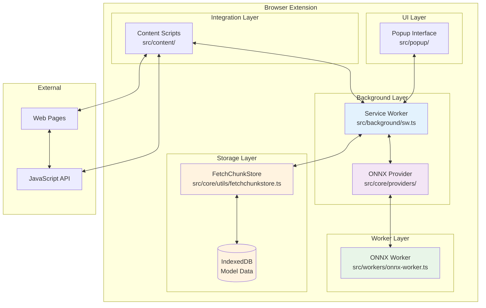
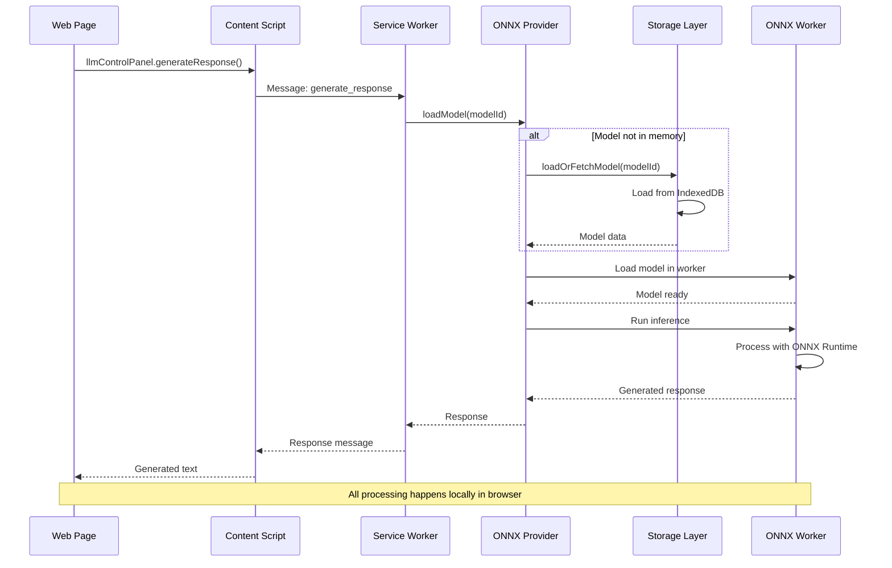

# LLM Control Panel

A browser extension for managing and controlling Large Language Models locally. This extension provides a middleware layer between local running models and 3rd-party applications that want to utilize AI models for various tasks.

## Features

- **Model Management**: Add, download, and manage ONNX-format language models
- **Provider Detection**: Automatic detection of available execution providers (WebNN, WebGPU, WASM)
- **Device Optimization**: Intelligent selection of optimal compute devices
- **Background Processing**: Service worker architecture for efficient model handling
- **Storage Management**: Persistent storage for models and configurations
- **API Interface**: Message-based API for external application integration
- **Third-Party App Approval**: Secure approval system for controlling access to LLM functionality

## Architecture

The extension consists of several key components:

- **Service Worker** (`src/background/sw.ts`): Core background process managing models, state, and app approvals
- **ONNX Provider** (`src/core/providers/onnx-provider.ts`): Handles ONNX model loading and inference
- **Web Worker** (`src/workers/onnx-worker.ts`): Dedicated thread for model execution
- **Popup Interface** (`src/popup/`): User interface for model management and app approval
- **Content Scripts** (`src/content/`): Integration with web pages and approval request routing
- **Storage Layer** (`src/core/utils/fetchchunkstore.ts`): Efficient IndexedDB-based storage for model data
- **API Layer** (`api.js`): Public API for third-party applications including approval requests



### Storage Architecture

The extension uses an optimized storage architecture that separates lightweight configuration data from heavy model blobs:

- **Model Configurations**: Lightweight metadata stored in memory and browser storage
- **Model Data**: Heavy binary data (ONNX models, tokenizer configs) stored in IndexedDB using chunked storage
- **On-Demand Loading**: Model data is only loaded when actually needed by workers or providers
- **Efficient Caching**: Automatic deduplication and chunk-based storage for optimal memory usage

This architecture significantly reduces memory footprint and improves performance by avoiding loading large model files until they're actively used.

## Service Worker API

The service worker provides a message-based API for managing models:

### Status
```javascript
chrome.runtime.sendMessage({type: 'status'}, (response) => {
  console.log('Available models:', response.models);
  console.log('Selected model:', response.selectedModel);
  console.log('Providers:', response.providers);
});
```

### Add Model
```javascript
chrome.runtime.sendMessage({
  type: 'addModel',
  model: {
    id: 'my-model',
    name: 'My Custom Model',
    url: 'https://example.com/model.onnx',
    size: '1.2GB'
  }
}, (response) => {
  console.log('Model added:', response.success);
});
```

### Download Model
```javascript
chrome.runtime.sendMessage({
  type: 'downloadModel',
  modelId: 'my-model'
}, (response) => {
  console.log('Download started:', response.success);
});
```

For complete API documentation, see [docs/service-worker-api.md](docs/service-worker-api.md).

## Third-Party App Approval System

The LLM Control Panel includes a comprehensive approval system that allows users to control which third-party applications can access the extension's functionality.

### Key Features

- **User Control**: Explicit approval required for third-party app access
- **Persistent Storage**: Approval decisions persist across browser sessions
- **Permission Management**: Fine-grained control over app permissions
- **Secure Origin-Based**: Approvals tied to specific domains/origins

### For Third-Party Developers

To integrate with the LLM Control Panel:

```javascript
// Request approval from user
const result = await window.llmCtl.requestApproval({
  name: 'My AI Assistant',
  description: 'A productivity tool for writing tasks',
  requestedPermissions: ['model-access', 'generate-response']
});

if (result.approved) {
  // Proceed with LLM operations
  const response = await window.llmCtl.generateResponse({
    prompt: 'Hello, world!',
    maxTokens: 100
  });
}
```

### Testing

Use the included test file to verify approval system functionality:

1. Load the extension in Chrome
2. Open `test-approval.html` in your browser
3. Test the approval flow

📖 **Detailed Documentation**: See [docs/approval-system.md](docs/approval-system.md) for complete API reference and implementation details.

## Development

### Prerequisites
- Node.js 16+
- npm or yarn

### Setup
```bash
npm install
npm run build
```

### Testing
Run the service worker test script:
```bash
node test-service-worker.js
```

### Build
```bash
npm run build
```

The built extension will be available in the `dist/` directory.

## Installation

1. Build the extension using `npm run build`
2. Open Chrome and navigate to `chrome://extensions/`
3. Enable "Developer mode"
4. Click "Load unpacked" and select the `dist/` directory

## Contributing

When contributing to this project:

1. Ensure all builds pass successfully
2. Follow existing code patterns and conventions
3. Update documentation for new features
4. Test thoroughly before submitting changes

The code reviewer requires that builds pass and functionality is never gutted to achieve passing builds.

## License

MIT License - see LICENSE file for details.

---

## Legacy Documentation

The following sections contain the original documentation for reference:

## Features

- 🚀 **Local Model Inference**: Run AI models directly in your browser using ONNX Runtime
- 🔒 **Privacy First**: All processing happens locally - no data sent to external servers
- 🎨 **Modern UI**: Built with Web Components for a clean, responsive interface
- 📱 **Cross-Platform**: Works on Chrome, Edge, and other Chromium-based browsers
- 🔧 **Developer Friendly**: Easy integration with websites via JavaScript API
- 📊 **Activity Tracking**: Monitor your AI interactions and model usage
- 🎯 **Multiple Models**: Support for TinyLlama, Llama 2, and more

## Tech Stack

- **TypeScript**: Type-safe development
- **Web Components**: Modern, reusable UI components
- **ONNX Runtime**: High-performance model inference
- **Vite**: Fast build tooling
- **Chrome Extensions API**: Browser integration

## Supported Models

- **TinyLlama 1.1B Chat**: Fast, lightweight model for quick responses
- **Llama 2 7B Chat**: Balanced performance and speed
- **Llama 2 13B Chat**: Higher quality responses with more parameters

## Installation

### Development Setup

1. Clone the repository:
```bash
git clone <repository-url>
cd LLMControlPanel
```

2. Install dependencies:
```bash
npm install
```

3. Start development server:
```bash
npm run dev
```

4. Build for production:
```bash
npm run build
```

### Loading the Extension

1. Open Chrome and navigate to `chrome://extensions/`
2. Enable "Developer mode" in the top right
3. Click "Load unpacked" and select the `dist` folder
4. The extension should now appear in your extensions list

## Usage

### Basic Usage

1. Click the extension icon in your browser toolbar
2. Navigate to the "Settings" tab
3. Select a model and click "Load Model"
4. Once loaded, you can test the model or use it in websites

### Website Integration

The extension provides a global API for websites to use:

```javascript
// Check if the extension is available
if (window.llmControlPanel) {
  // Generate a response
  const response = await window.llmControlPanel.generateResponse(
    "Hello, how are you?",
    "tinyllama-1.1b-chat"
  );
  console.log(response);
}
```

#### Model Inference Workflow



### API Reference

The extension provides a comprehensive API that works without Chrome extension APIs:

#### `window.llmControlPanel.isAvailable()`

Checks if the extension is available and ready to use.

- Returns: Promise<boolean> - Whether the extension is available

#### `window.llmControlPanel.generateResponse(prompt, modelId)`

Generates a response using the specified model.

- `prompt` (string): The input text to generate a response for
- `modelId` (string): The ID of the model to use (optional, uses default if not specified)
- Returns: Promise<string> - The generated response

#### `window.llmControlPanel.testModel(modelId, message)`

Tests a specific model with a message.

- `modelId` (string): The ID of the model to test
- `message` (string): The test message
- Returns: Promise<string> - The test response

#### `window.llmControlPanel.loadModel(modelId, useWorker)`

Loads a model for inference.

- `modelId` (string): The ID of the model to load
- `useWorker` (boolean): Whether to use a web worker (optional, default: false)
- Returns: Promise<boolean> - Whether the model was loaded successfully

#### `window.llmControlPanel.unloadModel(modelId, useWorker)`

Unloads a model from memory.

- `modelId` (string): The ID of the model to unload
- `useWorker` (boolean): Whether the model was loaded with a worker (optional, default: false)
- Returns: Promise<boolean> - Whether the model was unloaded successfully

#### `window.llmControlPanel.getAvailableModels()`

Gets the list of available models.

- Returns: Promise<Array> - Array of available model configurations

#### `window.llmControlPanel.getAvailableProviders()`

Gets the list of available ONNX providers.

- Returns: Promise<Array> - Array of available providers (webnn, webgpu, wasm)

#### `window.llmControlPanel.getWebNNDevices()`

Gets the list of available WebNN devices.

- Returns: Promise<Array> - Array of available WebNN devices

#### `window.llmControlPanel.getPreferredWebNNDevice()`

Gets the preferred WebNN device for inference.

- Returns: Promise<Object> - The preferred device configuration

#### `window.llmControlPanel.getCacheStats()`

Gets cache statistics.

- Returns: Promise<Object> - Cache statistics including size and model count

#### `window.llmControlPanel.getCachedModels()`

Gets the list of cached models.

- Returns: Promise<Array> - Array of cached model information

#### `window.llmControlPanel.clearAllCachedModels()`

Clears all cached models.

- Returns: Promise<boolean> - Whether the operation was successful

#### `window.llmControlPanel.cleanupOldCachedModels(maxAge)`

Removes cached models older than the specified age.

- `maxAge` (number): Maximum age in milliseconds
- Returns: Promise<number> - Number of models removed

## Project Structure

```
src/
├── popup/                 # Extension popup interface
│   ├── components/        # Web Components
│   │   ├── nav-bar.ts
│   │   ├── apps-view.ts
│   │   ├── activity-view.ts
│   │   ├── settings-view.ts
│   │   ├── help-view.ts
│   │   ├── about-view.ts
│   │   └── sliding-pane.ts
│   ├── index.html
│   └── index.ts
├── background/            # Service worker
│   └── index.ts
├── content/              # Content scripts
│   └── index.ts
└── core/                 # Shared components and utilities
    ├── components/
    ├── managers/
    ├── providers/
    └── views/
```

## Development

### Commands

- `npm run dev`: Start development server with hot reload
- `npm run build`: Build for production
- `npm run preview`: Preview the built extension
- `npm run lint`: Run ESLint
- `npm run type-check`: Run TypeScript type checking

### Adding New Models

1. Add the model configuration to `src/popup/components/settings-view.ts`
2. Update the ONNX model loading logic in `src/background/index.ts`
3. Test the model integration

### Customizing the UI

The UI is built with Web Components, making it easy to customize:

1. Modify the component styles in the `render()` method
2. Add new components in `src/popup/components/`
3. Update the main layout in `src/popup/components/llm-control-panel.ts`

## Privacy & Security

- **Local Processing**: All model inference happens in your browser
- **No Data Collection**: No user data is sent to external servers
- **Open Source**: Transparent codebase for security review
- **Permission Minimal**: Only requests necessary browser permissions

## Contributing

1. Fork the repository
2. Create a feature branch: `git checkout -b feature-name`
3. Make your changes
4. Run tests: `npm run lint && npm run type-check`
5. Commit your changes: `git commit -am 'Add feature'`
6. Push to the branch: `git push origin feature-name`
7. Submit a pull request

## License

This project is licensed under the MIT License - see the LICENSE file for details.

## Acknowledgments

- Inspired by [WebextLLM](https://github.com/idosal/WebextLLM)
- Built with [ONNX Runtime](https://onnxruntime.ai/)
- Powered by [Vite](https://vitejs.dev/)

## Support

- 📖 **Documentation**: Check the Help section in the extension
- 🐛 **Issues**: Report bugs on GitHub
- 💡 **Feature Requests**: Open an issue with your suggestion
- 💬 **Discussions**: Join the community discussions

---

**Note**: This is a development version. For production use, ensure all models are properly licensed and comply with their respective terms of use.