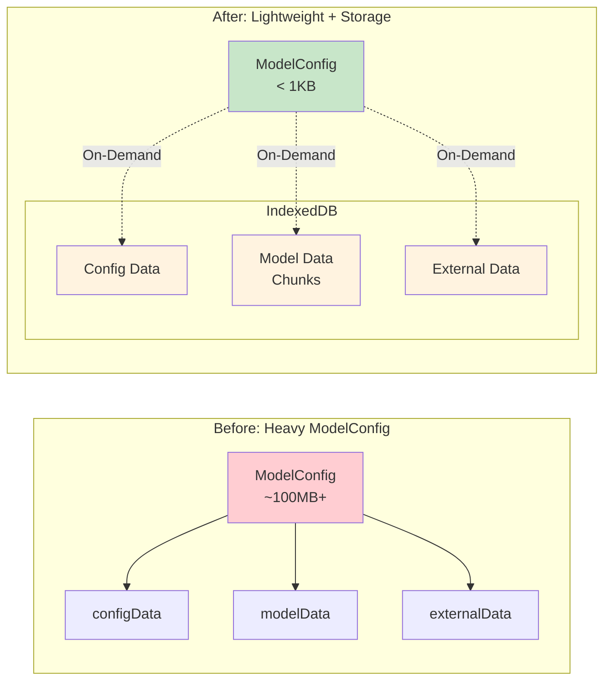
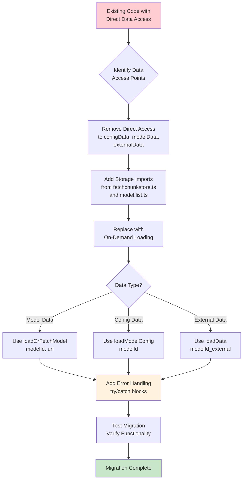

# API Changes - Model Configuration Refactoring

This document outlines the API changes introduced in the model configuration refactoring that removed heavy data fields from `ModelConfig` and implemented on-demand loading.

## Overview

The refactoring focused on separating lightweight configuration metadata from heavy model data blobs, implementing an on-demand loading pattern that significantly improves memory efficiency and performance.



## Breaking Changes

### ModelConfig Interface

**Before:**
```typescript
interface ModelConfig {
  modelId: string;
  name: string;
  url: string;
  size: string;
  modelFileName: string;
  configFileName: string;
  modelExDataFileName?: string;
  isDownloaded?: boolean;
  // Heavy data fields (REMOVED)
  configData?: any;
  modelData?: ArrayBuffer;
  externalData?: ArrayBuffer;
}
```

**After:**
```typescript
interface ModelConfig {
  modelId: string;
  name: string;
  url: string;
  size: string;
  modelFileName: string;
  configFileName: string;
  modelExDataFileName?: string;
  isDownloaded?: boolean;
  // Heavy data fields removed for memory efficiency
}
```

### OnnxModelFetch Function

**Before:**
```typescript
async function OnnxModelFetch(config: ModelConfig): Promise<ModelConfig> {
  // Fetched and returned model with heavy data populated
  return {
    ...config,
    configData: configData,
    modelData: modelArrayBuffer,
    externalData: externalArrayBuffer
  };
}
```

**After:**
```typescript
async function OnnxModelFetch(config: ModelConfig): Promise<void> {
  // Stores data directly in IndexedDB instead of returning it
  await loadOrFetchModel(config.modelId, config.url);
  
  const configResponse = await fetchAndCache(config.configFileName);
  const configData = await configResponse.json();
  await storeModelConfig(config.modelId, configData);
  
  // No return value - data is stored in IndexedDB
}
```

## New Storage Functions

### Core Storage Functions (`fetchchunkstore.ts`)

#### `storeData(key: string, data: any): Promise<void>`
Stores JSON/config data in IndexedDB.

```typescript
// Store configuration data
await storeData(`${modelId}_config`, configData);
```

#### `loadData(key: string): Promise<any>`
Retrieves JSON/config data from IndexedDB.

```typescript
// Load configuration data
const configData = await loadData(`${modelId}_config`);
```

#### `hasModelData(modelId: string): Promise<boolean>`
Checks if model data exists in IndexedDB storage.

```typescript
// Check if model is cached
const exists = await hasModelData(modelId);
if (!exists) {
  await downloadModel(modelId);
}
```

### Helper Functions (`model.list.ts`)

#### `storeModelConfig(modelId: string, configData: any): Promise<void>`
Convenience function for storing model configuration data.

```typescript
// Store model configuration
await storeModelConfig('tinyllama-1.1b', configData);
```

#### `loadModelConfig(modelId: string): Promise<any>`
Convenience function for loading model configuration data.

```typescript
// Load model configuration
const config = await loadModelConfig('tinyllama-1.1b');
```

## Component Updates

### ONNX Provider (`onnx-provider.ts`)

**Before:**
```typescript
// Direct access to heavy data fields
const modelData = cachedModel.modelData;
const configData = cachedModel.configData;
const externalData = cachedModel.externalData;
```

**After:**
```typescript
// On-demand loading from storage
const modelData = await loadOrFetchModel(cachedModel.modelId, cachedModel.url);
const configData = await loadModelConfig(cachedModel.modelId);

// Optional external data
let externalData;
if (cachedModel.modelExDataFileName) {
  externalData = await loadData(`${cachedModel.modelId}_external`);
}
```

### ONNX Worker (`onnx-worker.ts`)

**Before:**
```typescript
// Placeholder implementation
async loadModel(config: ModelConfig): Promise<void> {
  // TODO: Implement model loading
}
```

**After:**
```typescript
// Full implementation with on-demand loading
async loadModel(config: ModelConfig): Promise<void> {
  try {
    // Load model data from storage
    const modelData = await loadOrFetchModel(config.modelId, config.url);
    const configData = await loadModelConfig(config.modelId);
    
    // Optional external data
    let externalData;
    if (config.modelExDataFileName) {
      externalData = await loadData(`${config.modelId}_external`);
    }
    
    // Store loaded data
    this.loadedModels.set(config.modelId, {
      modelData,
      configData,
      externalData,
      size: this.formatBytes(modelData.byteLength)
    });
    
    console.log(`Model ${config.modelId} loaded successfully`);
  } catch (error) {
    console.error(`Failed to load model ${config.modelId}:`, error);
    throw error;
  }
}
```

### Service Worker (`sw.ts`)

**Before:**
```typescript
// Direct access to modelData property
const loadedConfig = await this.state.modelList.loadModel(modelId);
if (loadedConfig.modelData) {
  // Model downloaded successfully
}
```

**After:**
```typescript
// Check storage for model existence
await this.state.modelList.loadModel(modelId);
const { hasModelData } = await import('../core/utils/fetchchunkstore');
const modelExists = await hasModelData(modelId);
if (modelExists) {
  // Model downloaded successfully
}
```

## Migration Guide

### For Existing Code

1. **Remove Direct Data Access**: Replace direct access to `configData`, `modelData`, and `externalData` properties
2. **Add Storage Imports**: Import required functions from `fetchchunkstore.ts` and `model.list.ts`
3. **Implement On-Demand Loading**: Use storage functions to load data when needed
4. **Update Error Handling**: Add proper error handling for async storage operations



### Example Migration

**Before:**
```typescript
class MyComponent {
  async processModel(config: ModelConfig) {
    if (config.modelData) {
      // Process model data directly
      return this.runInference(config.modelData, config.configData);
    }
  }
}
```

**After:**
```typescript
import { loadOrFetchModel, loadModelConfig } from '../utils/fetchchunkstore';

class MyComponent {
  async processModel(config: ModelConfig) {
    try {
      // Load data on demand
      const modelData = await loadOrFetchModel(config.modelId, config.url);
      const configData = await loadModelConfig(config.modelId);
      
      return this.runInference(modelData, configData);
    } catch (error) {
      console.error('Failed to load model data:', error);
      throw error;
    }
  }
}
```

## Performance Considerations

### Memory Usage
- **Before**: Model configurations could be 100MB+ each in memory
- **After**: Model configurations are < 1KB each, data loaded on demand

### Loading Time
- **Initial Load**: Significantly faster as heavy data is not loaded upfront
- **First Use**: Slight delay when model data is first accessed (cached thereafter)
- **Subsequent Uses**: Fast access from IndexedDB cache

### Storage Efficiency
- **Deduplication**: Identical models are stored only once
- **Chunked Storage**: Large models are split into manageable chunks
- **Persistent Cache**: Data persists across browser sessions

## Error Handling

### Common Error Scenarios

1. **Model Not Found**: Handle cases where model data doesn't exist in storage
2. **Storage Quota**: Handle IndexedDB quota exceeded errors
3. **Network Failures**: Handle fetch failures during model download
4. **Corruption**: Handle corrupted data in storage

### Recommended Error Handling

```typescript
try {
  const modelData = await loadOrFetchModel(modelId, url);
  // Process model data
} catch (error) {
  if (error.name === 'QuotaExceededError') {
    // Handle storage quota exceeded
    await cleanupOldModels();
    throw new Error('Storage quota exceeded. Please free up space.');
  } else if (error.name === 'NetworkError') {
    // Handle network failures
    throw new Error('Failed to download model. Please check your connection.');
  } else {
    // Handle other errors
    console.error('Model loading error:', error);
    throw error;
  }
}
```

## Testing Considerations

### Unit Tests
- Mock storage functions for isolated testing
- Test error scenarios (network failures, storage errors)
- Verify data integrity after storage operations

### Integration Tests
- Test complete model loading workflows
- Verify performance improvements
- Test with multiple models and concurrent access

### Example Test

```typescript
describe('Model Loading', () => {
  it('should load model data on demand', async () => {
    const config = { modelId: 'test-model', url: 'test-url' };
    
    // Mock storage functions
    jest.spyOn(storage, 'loadOrFetchModel').mockResolvedValue(mockModelData);
    jest.spyOn(storage, 'loadModelConfig').mockResolvedValue(mockConfigData);
    
    const result = await component.loadModel(config);
    
    expect(storage.loadOrFetchModel).toHaveBeenCalledWith('test-model', 'test-url');
    expect(storage.loadModelConfig).toHaveBeenCalledWith('test-model');
    expect(result).toBeDefined();
  });
});
```