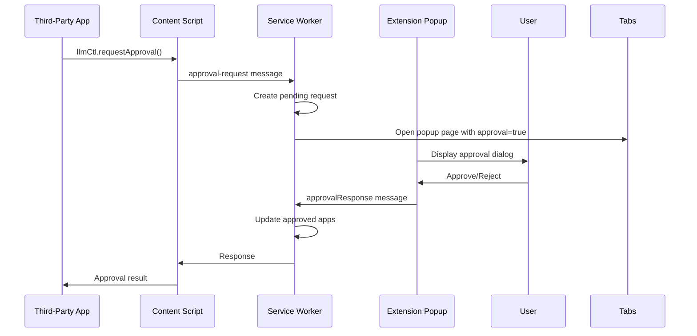

# Third-Party App Approval System

The LLM Control Panel includes a comprehensive approval system that allows users to control which third-party applications can access the extension's functionality.

## Overview

The approval system provides:
- **User Control**: Users must explicitly approve third-party applications before they can access LLM functionality
- **Persistent Storage**: Approval decisions are stored locally and persist across browser sessions
- **Permission Management**: Fine-grained control over what permissions each app receives
- **Revocation**: Users can revoke approval for previously approved applications

## Architecture



## API Reference

### For Third-Party Applications

#### `window.llmCtl.requestApproval(appInfo)`

Requests approval from the user to access LLM functionality.

**Parameters:**
- `appInfo` (object):
  - `name` (string): Display name of the application
  - `description` (string, optional): Description of what the app does
  - `requestedPermissions` (array, optional): List of permissions requested (defaults to `['model-access', 'generate-response']`)

**Returns:** Promise that resolves with approval result

**Example:**
```javascript
try {
  const result = await window.llmCtl.requestApproval({
    name: 'My AI Assistant',
    description: 'A productivity tool that helps with writing tasks',
    requestedPermissions: ['model-access', 'generate-response']
  });
  
  if (result.approved) {
    console.log('App approved!');
  } else {
    console.log('App rejected.');
  }
} catch (error) {
  console.error('Approval request failed:', error);
}
```

#### `window.llmCtl.checkApprovalStatus()`

Checks if the current application is approved.

**Returns:** Promise that resolves with approval status

**Example:**
```javascript
const status = await window.llmCtl.checkApprovalStatus();
if (status.approved) {
  // Proceed with LLM operations
} else {
  // Request approval first
}
```

## User Interface

### Approval Dialog

When a third-party application requests approval, the extension popup automatically opens with an approval dialog showing:

- **App Name**: The display name of the requesting application
- **Origin**: The domain/origin of the requesting page
- **Description**: Optional description provided by the app
- **Requested Permissions**: List of permissions the app is requesting
- **Actions**: Approve or Reject buttons

### Managing Approved Apps

Users can view and manage approved applications through the extension popup:

1. Open the LLM Control Panel extension popup
2. Navigate to the Apps section
3. View list of approved applications (fetched from the service worker)
4. Use the "Refresh" button to re-sync from storage if needed
5. Revoke approval for any app as needed (future UI enhancement)

## Security Considerations

### Origin-Based Approval
- Approvals are tied to the specific origin (domain) of the requesting page
- Subdomains are treated as separate origins
- HTTPS and HTTP are treated as different origins

### Permission Model
- Applications must specify which permissions they need
- Users see exactly what permissions are being requested
- Future versions may implement more granular permission controls

### Storage Security
- Approval data is stored in `chrome.storage.local`
- Data is encrypted by the browser and tied to the extension
- No sensitive data is transmitted to external servers

## Implementation Details

### Service Worker State

The approval system extends the service worker state with:

```typescript
interface ServiceWorkerState {
  approvedApps: Map<string, ApprovedApp>;
  approvedModelConfigs: Map<string, any>;
  pendingApprovalRequests: Map<string, ApprovalRequest>;
  // ... other state
}

interface ApprovedApp {
  origin: string;
  name: string;
  description?: string;
  approvedAt: number;
  permissions: string[];
}

interface ApprovalRequest {
  id: string;
  origin: string;
  appInfo: {
    name: string;
    description?: string;
    requestedPermissions: string[];
  };
  timestamp: number;
}
```

### Message Flow

1. **Request Initiation**: Third-party app calls `llmCtl.requestApproval()`
2. **Content Script Routing**: Content script forwards request to service worker
3. **Service Worker Processing**: Service worker creates pending request and triggers popup
4. **User Interaction**: Popup displays approval dialog
5. **Response Processing**: User decision is sent back through the chain
6. **State Update**: Service worker updates approved apps and persists to storage

### Storage Persistence

Approval data is automatically saved to and loaded from `chrome.storage.local`:

- **Save Trigger**: Whenever approval state changes
- **Load Trigger**: Service worker initialization
- **Data Format**: Serialized Map objects converted to/from arrays

## Testing

Use the provided test file to verify the approval system:

1. Load the extension in Chrome
2. Open `test-approval.html` in a browser tab
3. Click "Request Approval" to trigger the approval flow
4. Verify the popup opens with the approval dialog
5. Test both approval and rejection scenarios
6. Use "Check Approval Status" to verify persistence

## Troubleshooting

### Common Issues

**Extension not detected:**
- Ensure the LLM Control Panel extension is installed and enabled
- Check that the content script is properly injecting the API
- Verify the page is loaded over HTTP/HTTPS (not file://)

**Approval dialog not appearing:**
- Check browser popup blockers
- Ensure the extension has permission to open popups
- Verify the service worker is running

**Approval not persisting:**
- Check browser storage permissions
- Verify `chrome.storage.local` is available
- Check for storage quota issues

### Debug Information

Enable debug logging by opening the extension's service worker console:

1. Go to `chrome://extensions/`
2. Find "LLM Control Panel"
3. Click "service worker" link
4. Check console for approval-related messages

## Future Enhancements

- **Granular Permissions**: More specific permission types (read-only, specific models, etc.)
- **Temporary Approvals**: Time-limited approvals that expire automatically
- **Approval Analytics**: Usage tracking for approved applications
- **Bulk Management**: Tools for managing multiple approvals at once
- **Import/Export**: Backup and restore approval settings