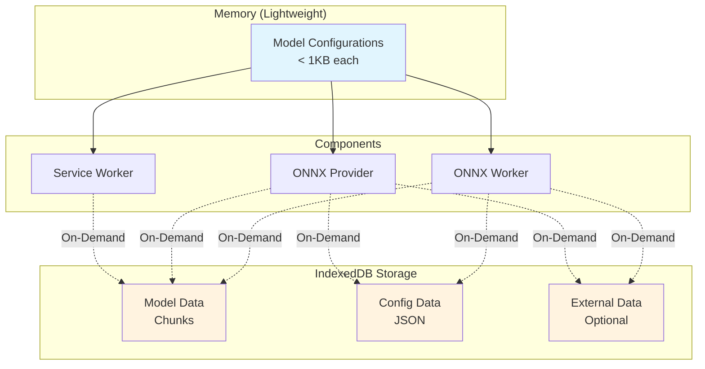
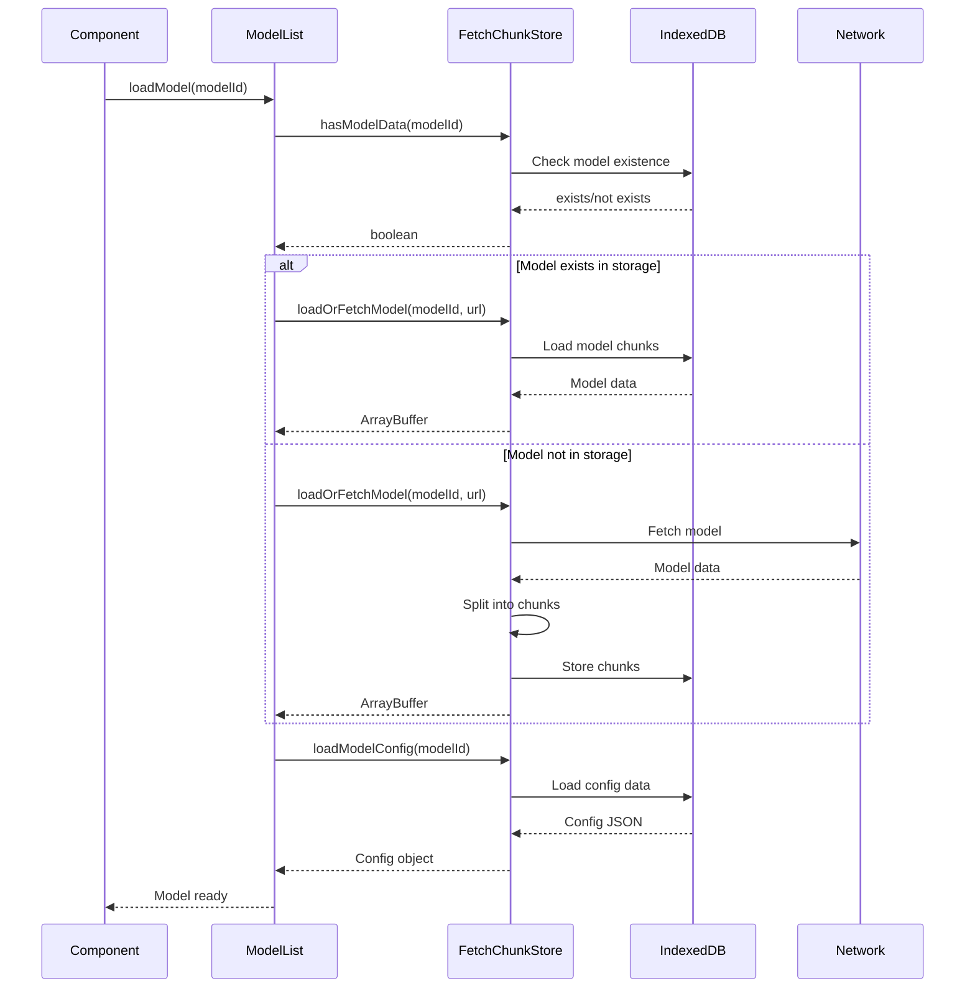

# Storage Architecture

This document describes the optimized storage architecture implemented in the LLM Control Panel extension, which separates lightweight configuration data from heavy model blobs for improved performance and memory efficiency.

## Overview

The storage architecture is designed around the principle of **on-demand loading**, where heavy model data is only loaded when actually needed by workers or providers. This approach significantly reduces memory footprint and improves application startup time.



## Architecture Components

### 1. Model Configuration (`ModelConfig`)

Lightweight metadata stored in memory and browser storage:

```typescript
interface ModelConfig {
  modelId: string;
  name: string;
  url: string;
  size: string;
  modelFileName: string;
  configFileName: string;
  modelExDataFileName?: string;
  isDownloaded?: boolean;
}
```

**Key Changes**: Removed heavy data fields (`configData`, `modelData`, `externalData`) to keep configurations lightweight.

### 2. Storage Layer (`fetchchunkstore.ts`)

IndexedDB-based storage system with the following capabilities:

#### Core Functions
- `loadOrFetchModel(modelId, url)`: Load model from storage or fetch and store if not cached
- `storeData(key, data)`: Store JSON/config data in IndexedDB
- `loadData(key)`: Retrieve JSON/config data from IndexedDB
- `hasModelData(modelId)`: Check if model data exists in storage

#### Chunked Storage
- Models are split into chunks for efficient storage and retrieval
- Automatic deduplication prevents storing duplicate model data
- Progress tracking during fetch and storage operations

### 3. On-Demand Loading Pattern

Components load data only when needed:

```typescript
// ONNX Provider - loads model data on demand
const modelData = await loadOrFetchModel(config.modelId, config.url);
const configData = await loadData(`${config.modelId}_config`);

// ONNX Worker - loads model blobs for inference
const modelData = await loadOrFetchModel(config.modelId, config.url);
const configData = await loadModelConfig(config.modelId);
```

## Implementation Details

### Model Loading Flow

1. **Configuration Loading**: Lightweight `ModelConfig` objects are loaded first
2. **Existence Check**: Use `hasModelData()` to verify if model data is cached
3. **On-Demand Fetch**: Heavy model data is loaded only when needed:
   - ONNX Provider: During model initialization
   - ONNX Worker: During inference session creation
   - Service Worker: During download verification



### Storage Functions

#### `OnnxModelFetch(config: ModelConfig): Promise<void>`

Updated to store data directly in IndexedDB instead of returning heavy data:

```typescript
// Store model data
await loadOrFetchModel(config.modelId, config.url);

// Store config data
const configResponse = await fetchAndCache(config.configFileName);
const configData = await configResponse.json();
await storeModelConfig(config.modelId, configData);
```

#### Helper Functions

```typescript
// Store model configuration
async function storeModelConfig(modelId: string, configData: any): Promise<void>

// Load model configuration
async function loadModelConfig(modelId: string): Promise<any>
```

### Provider Integration

#### ONNX Provider (`onnx-provider.ts`)

```typescript
// Load model data on demand
const modelData = await loadOrFetchModel(cachedModel.modelId, cachedModel.url);
const configData = await loadModelConfig(cachedModel.modelId);

// Load external data if needed
let externalData;
if (cachedModel.modelExDataFileName) {
  externalData = await loadData(`${cachedModel.modelId}_external`);
}
```

#### ONNX Worker (`onnx-worker.ts`)

```typescript
// Load all required data for inference
const modelData = await loadOrFetchModel(config.modelId, config.url);
const configData = await loadModelConfig(config.modelId);

// Optional external data
let externalData;
if (config.modelExDataFileName) {
  externalData = await loadData(`${config.modelId}_external`);
}
```

## Benefits

### Memory Efficiency
- **Reduced Memory Footprint**: Model configurations are now lightweight (< 1KB vs potentially 100MB+)
- **On-Demand Loading**: Heavy data only loaded when actively used
- **Automatic Cleanup**: IndexedDB handles memory management efficiently

### Performance Improvements
- **Faster Startup**: Application loads quickly without heavy model data
- **Efficient Caching**: Chunked storage prevents duplicate downloads
- **Background Loading**: Models can be downloaded and stored without blocking UI

### Scalability
- **Multiple Models**: Can manage many model configurations without memory issues
- **Large Models**: Chunked storage handles models of any size
- **Concurrent Access**: Multiple components can access storage simultaneously

## Migration Notes

### Breaking Changes
- `ModelConfig` interface no longer includes `configData`, `modelData`, or `externalData`
- `OnnxModelFetch` now returns `Promise<void>` instead of populated `ModelConfig`
- Components must use storage functions to access model data

### Compatibility
- Existing model configurations will continue to work
- New storage functions are backward compatible
- IndexedDB storage is persistent across browser sessions

## Best Practices

### For Developers
1. **Check Existence**: Always use `hasModelData()` before attempting to load
2. **Error Handling**: Implement proper error handling for storage operations
3. **Memory Management**: Don't hold references to large model data unnecessarily
4. **Progress Tracking**: Use progress callbacks for user feedback during downloads

### For Components
1. **Lazy Loading**: Only load model data when actually needed
2. **Caching**: Store frequently accessed config data in memory
3. **Cleanup**: Release model data references when no longer needed
4. **Validation**: Verify data integrity after loading from storage

## Future Enhancements

- **Compression**: Add compression for stored model data
- **Versioning**: Implement version management for cached models
- **Cleanup**: Automatic cleanup of unused cached models
- **Metrics**: Storage usage analytics and optimization recommendations